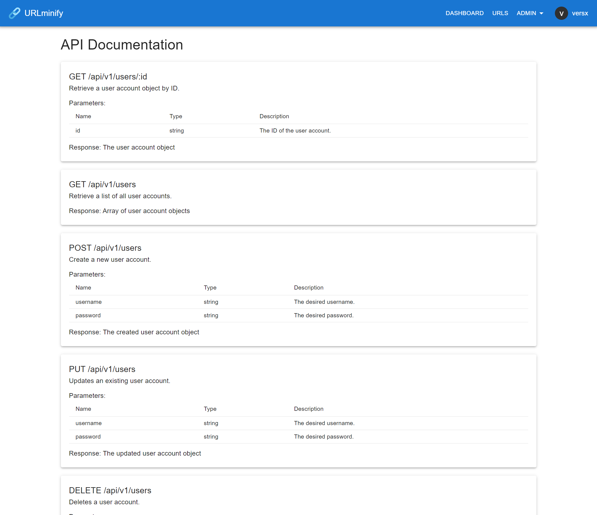
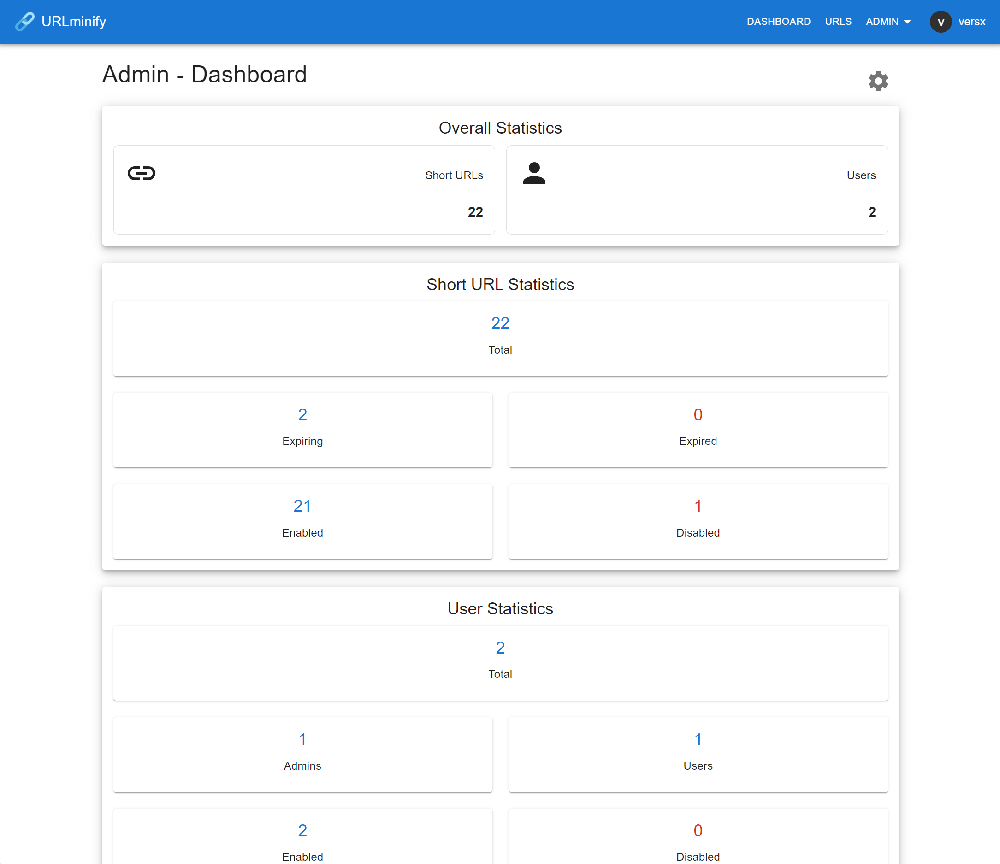
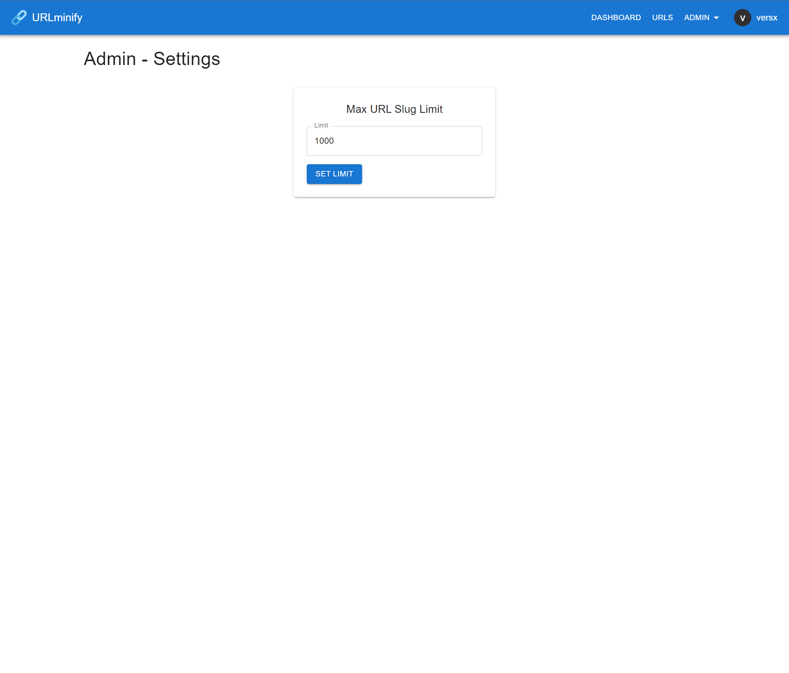

[](https://github.com/versx/DiscordGuildStats/releases/)
[](https://github.com/versx/DiscordGuildStats/graphs/contributors/)
[](https://discord.gg/zZ9h9Xa)  

# URLminify
NodeJS frontend and backend to create short URL addresses from longer URL addresses.  


## Prerequisites
- [Node.js v18 or higher](https://nodejs.org/en/download)  


## Installation

1. Clone repository: `git clone https://github.com/versx/URLminify`  

### Client  
1. Install packages: `npm install`  
1. Copy example config: `cp src/config.example.json src/config.json`  
1. Fill out config options.  
1. Build project in root folder: `npm run build`  
1. Run: `npm run start`  

### Server  
1. Change directories: `cd server`  
1. Install packages: `npm install`  
1. Copy example config: `cp src/config.example.json src/config.json`  
1. Fill out config options.  
1. Build project in root folder: `npm run build`  
1. Run: `npm run start`  


## Updating  

### Client
1. Pull latest changes in root folder `git pull`  
1. Build client project in root folder: `npm run build`  
1. Run `npm run start`  

### Server
1. Pull latest changes in root folder `git pull`  
1. Change directories: `cd server`  
1. Build server project: `npm run build`  
1. Run `npm run start`  


## Configuration

### Client  
```json
{
  // Base API url address of server.
  "apiUrl": "http://127.0.0.1:8080/api/v1/",
  // Domain name used for URL slugs.
  "domain": "http://127.0.0.1:8080"
}
```

### Server
```json
{
  // Host IP address to list on.
  "host": "0.0.0.0",
  // Port to listen on.
  "port": 8080,
  // Base domain for URLminify shortened links.
  "domain": "https://example.com",
  // Authorization options.
  "auth": {
    // Initial Administrator user account seed.
    "admin": {
      // Username for admin account.
      "username": "admin",
      // Password for admin account.
      "password": "p4ssw0rd!"
    },
    // Secret token used for creating JsonWebTokens (JWTs).
    "secret": "auth token"
  },
  // Database options.
  "database": {
    // Database dialect to use. (i.e. mysql/mariadb)
    "dialect": "mysql",
    // Database host address.
    "host": "127.0.0.1",
    // Database listening port.
    "port": 3306,
    // Database account username.
    "username": "root",
    // Database account password.
    "password": "password",
    // Database name.
    "database": "urlminifydb",
    // Timezone used for `createdAt` and `updatedAt` column values.
    "timezone": "America/Denver",
    // Whether to enable or disable Sequelize database
    // query logging.
    "logging": false
  },
  // Logging options.
  "logs": {
    // Log level to use. (none, trace, debug, info, warn, error)
    "level": "info",
    // Log color options.
    "colors": {
      "text": "#ffffff",
      "variable": "#ff624d",
      "date": "#4287f5",
      "warn": "#ffff00",
      "error": "#ff0000"
    }
  }
}
```

## Screenshots  
**Dashboard**  
[](.github/images/dashboard.png)  
| Short URLs | Settings | API Documentation
| ------------- | ------------- | ------------- |
| <a href="https://raw.githubusercontent.com/versx/URLminify/master/.github/images/urls.png"></a> | <a href="https://raw.githubusercontent.com/versx/URLminify/master/.github/images/settings.png"></a> | <a href="https://raw.githubusercontent.com/versx/URLminify/master/.github/images/api-docs.png"></a>

**Admin Dashboard**  
[](.github/images/admin-dashboard.png)  
| Short URLs  | Users | Settings |
| ------------- | ------------- | ------------- |
| <a href="https://raw.githubusercontent.com/versx/URLminify/master/.github/images/admin-urls.png"></a> | <a href="https://raw.githubusercontent.com/versx/URLminify/master/.github/images/admin-users.png"></a> | <a href="https://raw.githubusercontent.com/versx/URLminify/master/.github/images/admin-settings.png"></a> |
